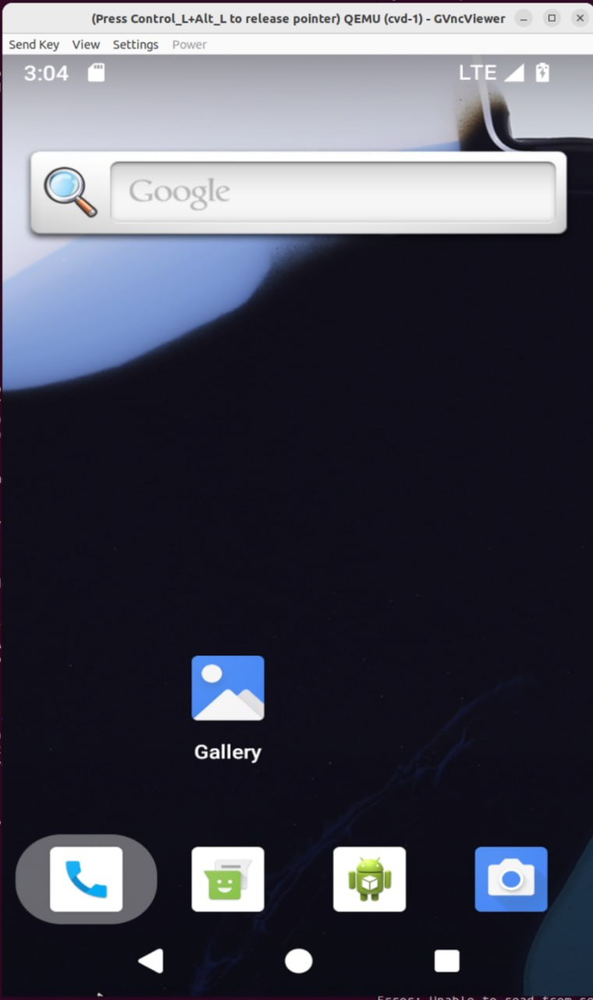

# android-riscv 與 cuttlefish安裝流程
## build process

* android riscv

    ref:https://github.com/google/android-riscv64
    依aosp官方流程sync正個repo後，執行以下指令
    ```
    $ cd aosp
    $ source build/envsetup.sh
    $ lunch aosp_cf_riscv64_phone-userdebug

    ============================================
    PLATFORM_VERSION_CODENAME=UpsideDownCake
    PLATFORM_VERSION=UpsideDownCake
    TARGET_PRODUCT=aosp_cf_riscv64_phone
    TARGET_BUILD_VARIANT=userdebug
    TARGET_ARCH=riscv64
    TARGET_ARCH_VARIANT=riscv64
    TARGET_CPU_VARIANT=generic
    HOST_OS=linux
    HOST_OS_EXTRA=Linux-5.19.11-1rodete1-amd64-x86_64-Debian-GNU/Linux-rodete
    HOST_CROSS_OS=windows
    BUILD_ID=AOSP.MASTER
    OUT_DIR=out
    ============================================
    $ make -j
    ```
    編譯後的target image(riscv64)會在aosp/out/target/product/vsoc_riscv64，而每個image編譯完後都會有對應的host image在aosp/out/host/linux-x86，這裡將linux-x86/* 所有檔案複製到aosp/out/target/product/vsoc_riscv64下
    ```

* cuttlefish
        
    ref:https://source.android.com/docs/setup/create/cuttlefish-use?hl=en

* qemu
    ```sh
    git clone https://github.com/qemu/qemu
    cd qemu
    mkdir build
    cd build
    ../configure --enable-gio --enable-kvm --enable-gcov --enable-spice --enable-virglrenderer --enable-vnc --enable-gtk --enable-opengl --prefix=~/workstation/PLLAB/qemu/build
    make -j32
    ```

    安裝好後在build資料匣下測試一次qemu-system-riscv64。
    ```sh
    ./qemu-system-riscv64 -display egl-headless
    ```

    在安裝qemu有遇到一些問題，但是在configure時加上--enable-feature(如上述指令的feature)後就可以正常執行了。

## run process
run emulator    
```sh
cd aosp/out/target/product/vsoc_riscv64
HOME=$PWD ./bin/launch_cvd -cpus=8 --memory_mb=8192 -qemu_binary_dir=/home/cluster/workstation/PLLAB/qemu/build --gpu_mode=drm_virgl -guest_enforce_security=false --start_webrtc=true
```
run vnc-client to render the screen
```
vncviewer localhost:6444
```


